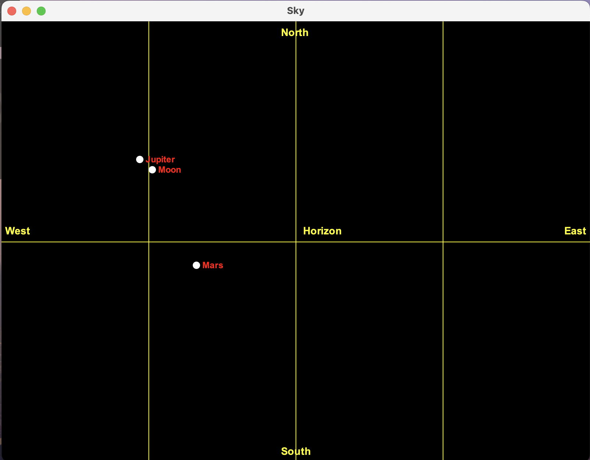

# 🌌 Astronomy Sky Visualizer

**A Java Swing application that visualizes the real-time night sky using live data from [AstronomyAPI](https://astronomyapi.com/).**

---

## ✨ Features

- 🎯 **Accurate positions** of Sun, Moon, and major planets
- 🖥️ **Interactive sky chart** with labeled celestial bodies
- 📡 **Live data** from AstronomyAPI (altitude & azimuth)
- 🧩 **Modular Java code** (Retrofit, RxJava, Swing)
- 📍 Default location: Cedarhurst, NY (customizable)

---

## 📸 Screenshot



---


## 🗂️ Project Structure
```
src/
├── main/
│   ├── java/
│   │   └── spinner/astronomy/
│   │       ├── AstronomyFrame.java
│   │       ├── AstronomyController.java
│   │       ├── AstronomyService.java
│   │       ├── AstronomyServiceFactory.java
│   │       ├── SkyPanel.java
│   │       ├── CelestialBody.java
│   │       └── json/
│   │           └── AstronomyResponse.java
│   └── resources/
│       └── apikey.properties   # (not committed)
└── test/
    └── java/
        └── spinner/astronomy/
            └── AstronomyServiceTest.java
```


## 👩‍💻 Author

Created by Leora Spinner for Computer Methodology


