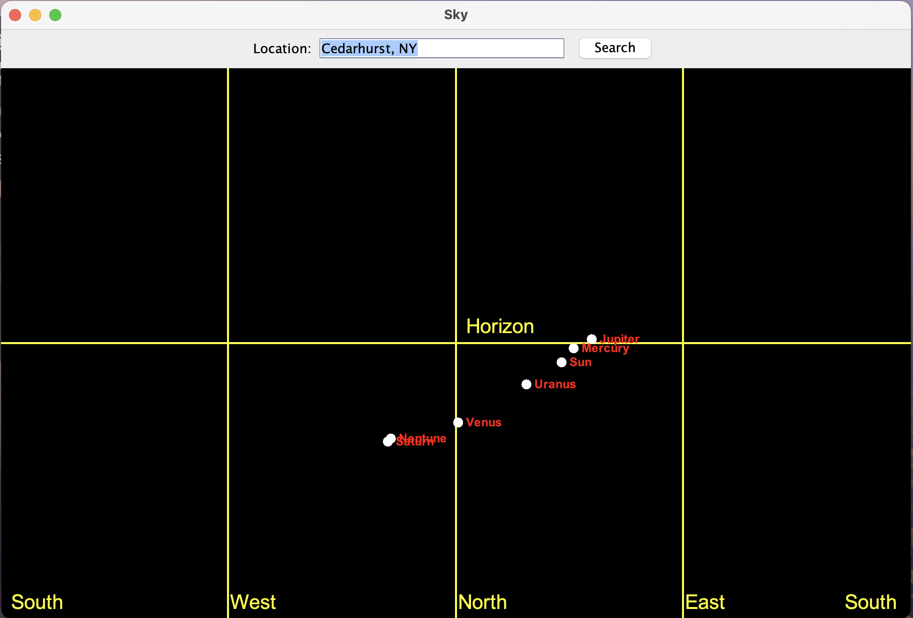

# 🌌 Astronomy Sky Visualizer

**A Java Swing application that visualizes the real-time night sky using live data from [AstronomyAPI](https://astronomyapi.com/).**

---

## ✨ Features

- 🎯 **Accurate positions** of Sun, Moon, and major planets
- 🖥️ **Interactive sky chart** with labeled celestial bodies
- 📡 **Live data** from AstronomyAPI (altitude & azimuth)
  - https://docs.astronomyapi.com/endpoints/bodies/positions
- 🧩 **Modular Java code** (Retrofit, RxJava, Swing)
- 📍 Default location: Cedarhurst, NY (customizable)

---

## 📸 Screenshot



---

```


## 👩‍💻 Author

Created by Leora Spinner for Computer Methodology


